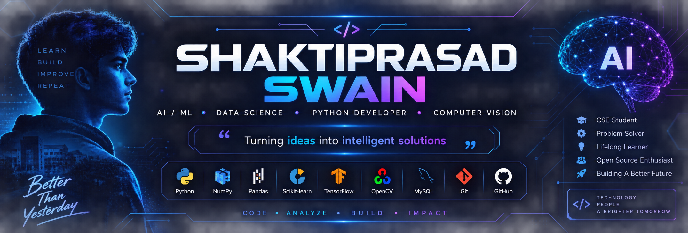

  

  

<h1 align="center">Hi 👋, I'm Shakti Prasad Swain</h1>

  <b>CSE • Data Science • AI/ML • Computer Vision</b>

  <i>Building intelligent systems and learning something new every day 🚀</i>

  

  

---

<h2 align="center">◈ SYSTEM PROFILE</h2>

  
  
  

<table align="center">
<tr>

<td align="center" width="50%">

### 🐍 CORE

Python  
NumPy • Pandas  
Matplotlib • Seaborn  
Scikit-learn  
SQL

</td>

<td align="center" width="50%">

### 🧠 AI / DEEP LEARNING

Machine Learning  
TensorFlow • Keras  
CNN  
Computer Vision  
NLP

</td>

</tr>
</table>

  <code>████████████████████████████</code>

  <b>⚡ BUILD • LEARN • EXPERIMENT • DEPLOY ⚡</b>

---

<h2 align="center">🚀 CURRENTLY BUILDING</h2>

<table align="center">
<tr>

<td width="50%" align="center">

### 🛰️ CNN & Computer Vision

Building image classification and computer vision systems using

**TensorFlow • Keras • CNN • OpenCV**

</td>

<td width="50%" align="center">

### 🧠 AI / ML

Exploring

**Machine Learning • Deep Learning • NLP**

with a focus on real-world applications.

</td>

</tr>
</table>

  

---

<h2 align="center">📊 GITHUB ANALYTICS</h2>

  

---

<h2 align="center">🔥 CONTRIBUTION STREAK</h2>

  

---

<h3 align="center">📊 Data Science & Machine Learning</h3>

  

<h3 align="center">🧠 Deep Learning</h3>

  

<h3 align="center">👁️ Computer Vision & Data Analysis</h3>

  

<h3 align="center">🛠️ Tools</h3>

  

---

<h2 align="center">💡 MISSION</h2>

  <b>LEARN • BUILD • ANALYZE • IMPROVE • IMPACT</b>

  <i>"Turning data into intelligent solutions."</i>

---

<h2 align="center">📈 PROFILE</h2>

  

  ⭐ If you find my projects useful, consider giving them a star!

